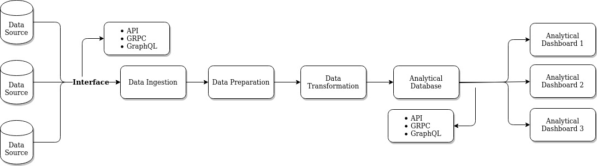

# Task
This task related to as data engineer. 

# Prerequisite
1. linux environment
2. python3+
3. postgresql
4. mongodb


## run
1. clean the json file (complex.json and tower.json)
```
grep -v '^/' complex.json > wew.json
```
2. create a database in mongodb and restore that file
3. create database in postgresql with the table that mentioned already
4. activate environment
```
source env/bin/activate
```
5. install all dependencies
```
pip install -r requirements.txt
```
6. run script process.py and make sure the version is python3+
```
python process.y
```

# Result
1. the data will be stored in database both mongodb and postgresql
2. it can be seen also as CSV file


# Data Architecture


